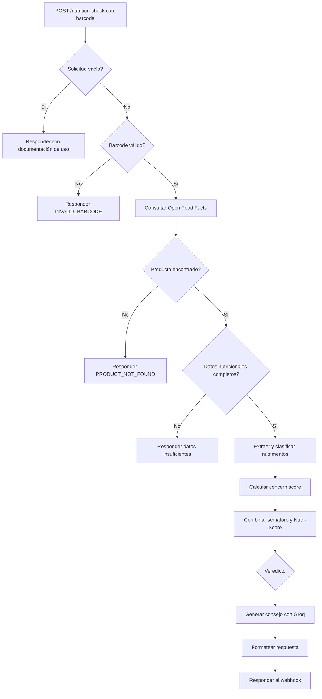

# Patrones del sistema

## Arquitectura observada

El artefacto de aplicación descrito en `README.md` es un workflow n8n exportado en `Proyecto 4 GEEKS.json`. Su webhook usa `POST` y la ruta `nutrition-check`. El repo no contiene código de frontend en `uis/` ni implementación de API o worker en `services/`; ambas carpetas contienen solo README. No se evidencia conexión frontend-backend.

## Flujo de SnackCheck

El flujo definido por los nodos y conexiones de `Proyecto 4 GEEKS.json` es:

La documentación `README.md` describe los veredictos saludable, moderado y no saludable, además de errores por barcode inválido, producto ausente y datos insuficientes. El nodo de código `Calcular - Concern Score` suma uno por cada nivel alto de azúcar, sal y grasa; el export incluye evaluación separada de Nutri-Score y rutas de generación de mensaje para los tres veredictos.

## Otros artefactos sin integración demostrada

- `skills/data-analysis/scripts/pandas_clean.py` lee un `data.csv`, elimina columnas completamente nulas, normaliza nombres de columnas, elimina duplicados y muestra resultados. No hay evidencia de que lo invoque el workflow n8n ni de que escriba datos para un backend.
- `packages/shared/types/index.ts` define tipos genéricos `Id` y `BaseEntity`. No se encontró un frontend o backend que los consuma.
- `CONTEXT.md` describe dashboards y necesidades de TrackFlow, pero no hay código de interfaz ni una API de TrackFlow conectada a esas funciones.

## Límites de lo verificable

El JSON exportado tiene `active: false`. `verificacion.md` indica que no se pudo confirmar ejecución, URL base ni puerto de una instancia n8n. El flujo anterior representa la configuración del export, no un servicio comprobado en funcionamiento.